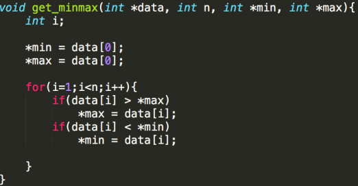
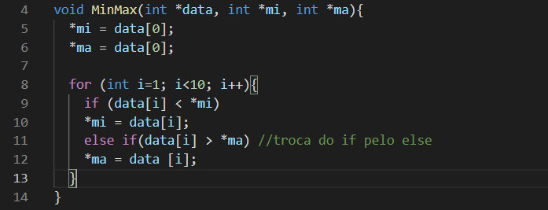

<h1 align= "center">
    
</h1>

# Custo Computacional

## Ygor Santos Vieira 
---

## Resumo

A medida do custo de execução de um algoritmo depende principalmente do tamanho da entrada dos dados. É comum considerar o tempo de execução de um programa como uma função do tamanho da entrada. Para alguns algoritmos, o custo de execução é uma função da entrada particular dos dados, não apenas do tamanho da entrada.


---
## 🔖 Sobre

A atividade proposta tem como objetivo diminuir o custo computacional do programa abaixo:

<h1 align= "center">
    
</h1>

A função de custo é expressa por um polinômio, em relação ao tamanho da entrada. O tempo gasto é demonstrado por:

````
MinMax(N) =
    N*(tempo gasto por uma comparação i e N) +
    N*(tempo gasto para incrementar i) +
    N*(tempo gasto por um print)
````
Isso daria, no caso, a função de custo MinMax(N) em relação ao tamanho da entrada N. Como visto em sala, calculamos o custo desse algoritmo e identificamos que suas computações gastam *f(n)=2(n-1)* operações para a obtenção de resultados. 
A partir do problema proposto foi modificado o uso dos dois "*if*", retirando assim o segundo "*if*" e substituindo por um "*else if*". Sendo assim, o custo que era representado por "*f(n)=2(n-1)*" passou a ser por "*f(n)=n-1*" reduzindo assim o custo pela metade. Na melhor das hipóteses o "*else if*" só será executado caso o "*if*" vem a ser negativo.

<h1 align="center">
    
</h1>

---
## 🚀 Tecnologias utilizadas

O projeto foi desenvolvido em:
- [C](https://pt.wikipedia.org/wiki/C_(linguagem_de_programa%C3%A7%C3%A3o))
---
## 📁Como baixar o projeto

```bash
    #clonar o repositório
    $ git clone https://github.com/eplaie/Aeds-I

    #Entrar no diretório
    $ cd Aeds-I

```

## Referências 

https://pt.wikipedia.org/wiki/C_(linguagem_de_programa%C3%A7%C3%A3o)


